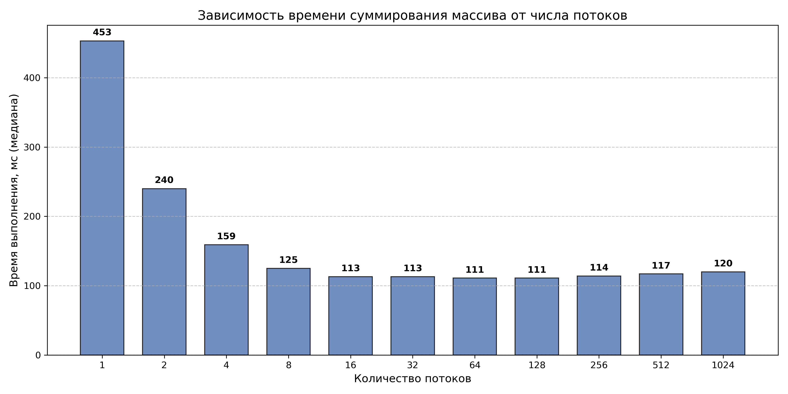

## Результаты замеров времени (мс)

Сделано по 5 измерений для каждого числа потоков. Значения отсортированы по возрастанию, **медиана выделена жирным**.

| Потоки | Замер 1 | Замер 2 | **Медиана** | Замер 4 | Замер 5 |
|:------:|:-------:|:-------:|:-----------:|:-------:|:-------:|
| 1      | 390     | 408     | **453**     | 454     | 539     |
| 2      | 217     | 228     | **240**     | 245     | 247     |
| 4      | 145     | 157     | **159**     | 160     | 160     |
| 8      | 124     | 124     | **125**     | 125     | 128     |
| 16     | 110     | 112     | **113**     | 113     | 114     |
| 32     | 112     | 112     | **113**     | 115     | 115     |
| 64     | 110     | 110     | **111**     | 112     | 114     |
| 128    | 110     | 111     | **111**     | 112     | 113     |
| 256    | 112     | 114     | **114**     | 115     | 118     |
| 512    | 114     | 115     | **117**     | 117     | 120     |
| 1024   | 119     | 119     | **120**     | 121     | 124     |

## График зависимости времени от числа потоков

## Параметры среды

- **ОС:** Ubuntu
- **Компилятор:** g++ (флаги `-O2 -pthread -std=c++17`)